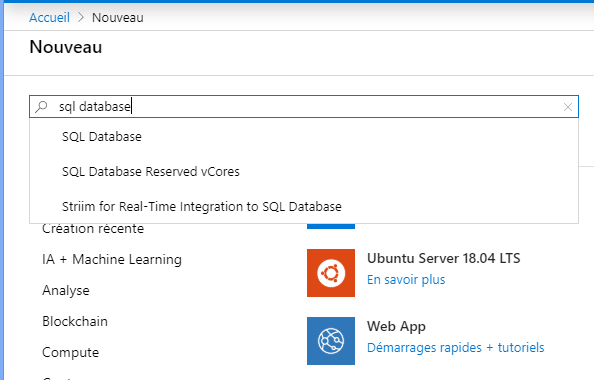
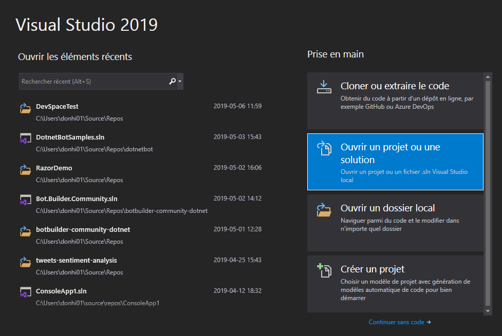

# Utiliser Azure SQL Database

<a href="https://docs.microsoft.com/fr-ca/azure/sql-database/">Azure SQL Database</a> est un service que vous utilisez pour créer une base de données relationnelle dans le cloud compatible avec Microsoft SQL Server. SQL Database est un service hautement évolutif. Il peut prendre en charge plusieurs milliers de demandes simultanées. Dans SQL Database, vous pouvez définir des tables, puis insérer, mettre à jour, supprimer et interroger des données.

##  Objectif

Pour cette troisième partie du laboratoire, les participants vont créer une base de données Azure SQL Database en utilisant le portail Azure. Ils vont ensuite configurer leur application Web pour se connecter à la base de données et l'interroger.

## Créer une base de données Azure SQL 

1. Ouvrez le portail Azure (portal.azure.com).

2. Cliquez sur le bouton **Créer une ressource**

3. Dans la fenêtre qui va s'afficher, saisir dans la zone de recherche, saisir **SQL Database** et selectionner le service correspondant

  

4. Dans la fenêtre qui va s'afficher, cliquez sur le bouton **Créer**

## Ouvrir le projet de demarrage</a>

1. Ouvrez Visual Studio, puis sélectionnez **Ouvrir un projet ou une solution**.

 

2. Ouvrez la solution de l'étape 3 (\Etape 3 - Utiliser Azure SQL Database\Workshop\Workshop.sln).
