# CI & CD avec Azure DevOps

Azure DevOps offre un ensemble de services de développement modernes pour la planification agile, la collaboration, l'intégration continue et la livraison rapide des applications.

##  Objectif

Dans ce quatrième et dernier laboratoire, nous allons utiliser Azure DevOps pour déployer une application ASP.NET Core sur Azure App Service. Nous allons nous familliariser avec les outils services suivants d'Azure DevOps :

1. **Azure Repos** : gestionnaire de version Git hébergé dans Cloud permettant de collaborer et créer un code de meilleure qualité avec les demandes de tirage et la gestion avancée des fichiers.

2. **Azure Pipelines** : service Cloud permettant de générer, tester et déployer des application avec une approche CI/CD qui fonctionne avec n’importe quel langage, plateforme et cloud. 

## Créer un projet Azure DevOps

Allez sur **<a href="http://dev.azure.com/">dev.azure.com</a>**.  Cliquez sur **Démarrer gratuitement**.
  
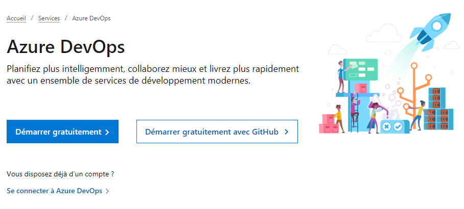

Vous devez ensuite vous authentifier avec votre compte Microsoft Azure. Puis cliquer sur **Continuer**.

Une nouvelle organisation Azure sera créée pour votre compte. Vous devez ajouter à cette dernière un nouveau projet. Il suffit juste de renseigner le nom du projet, puis cliquer sur **Create project**.


## Pousser le code dans Azure Repos

Dans Azure DevOps, cliquez dans le menu à gauche sur **Repos**.

Copiez le lien dans la zone **Clone to your computer**


Ouvrez l'invite de commande à partir du repertoire **workshop-azure-aspnet-core-devops**.

> Le moyen le plus simple de le faire avec Visual Studio est d'aller sur **Team Explorer**, puis cliquer sur **Modifications**, ensuite sur **Actions** et enfin sur **Ouvrir l'invite de commandes**.

Executez ensuite la commande :

```
git remote set-url origin [url-depot-azure-repos]
```

Puis la commande :

```
git push -u origin --all 
```

> Une fênetre d'authentification va s'afficher. Veuillez vous authentifier avec votre compte Azure.

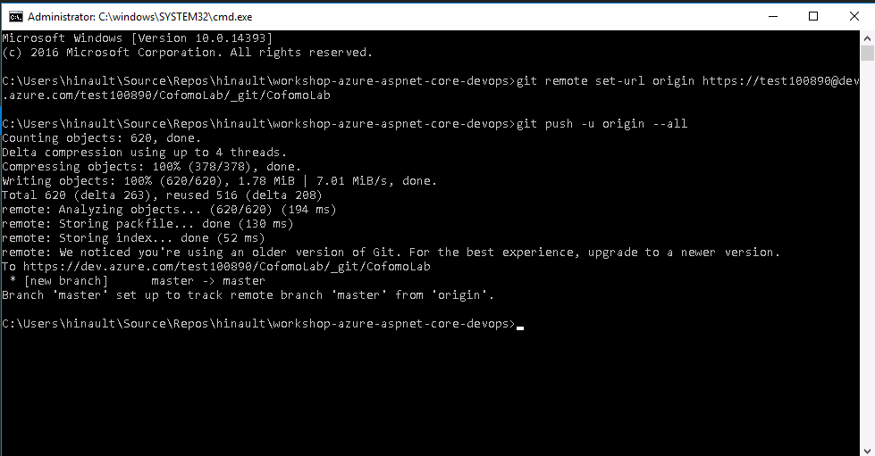

Retournez dans Azure DevOps et actualisez la page. Vous devez voir les fichiers du laboratoire dans votre dépôt :

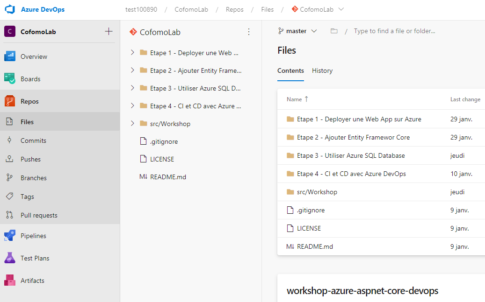

## Créer le pipeline de CI et CD

Nous allons utiliser le **Centre de déploiement Azure App Service** pour générer notre pipeline d'intégration et de déploiement en continu. 

**Le Centre de déploiement** est une vue d’ensemble centralisée de toutes les méthodes de déploiement prises en charge par votre application. Il constitue également une expérience guidée pour la configuration de l’intégration continue et du déploiement continu.

Pour créer votre pipeline de CI et CD, vous devez :

1. Acceder à l'interface de gestion de votre application dans le portail Azure.

2. Sur la page de l'application, sélectionnez **Centre de déploiement** dans le menu de gauche.

3. Sélectionnez le fournisseur de contrôle de code source **Azure Repos** à l'étape **Contrôle de code source**, puis cliquez sur  **Continuer**.

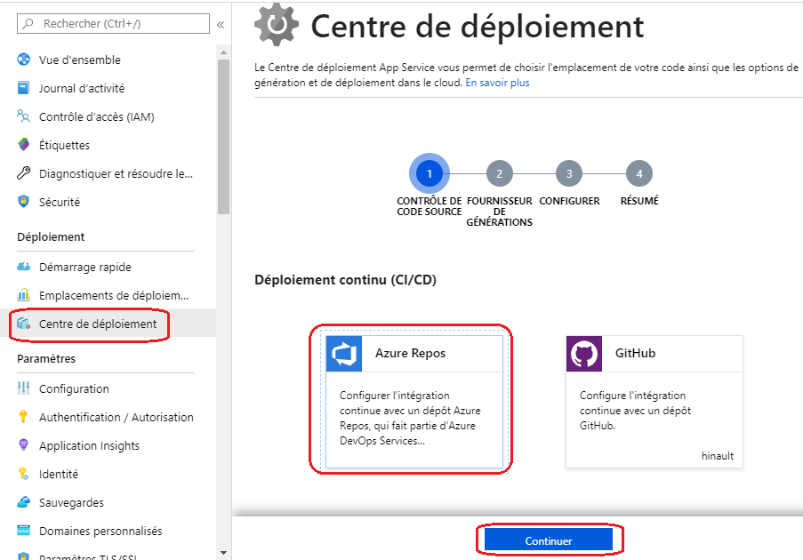

4. À l'étape **Fournisseur de builds**, sélectionnez **Azure Pipelines**, puis cliquez sur **Continuer**.

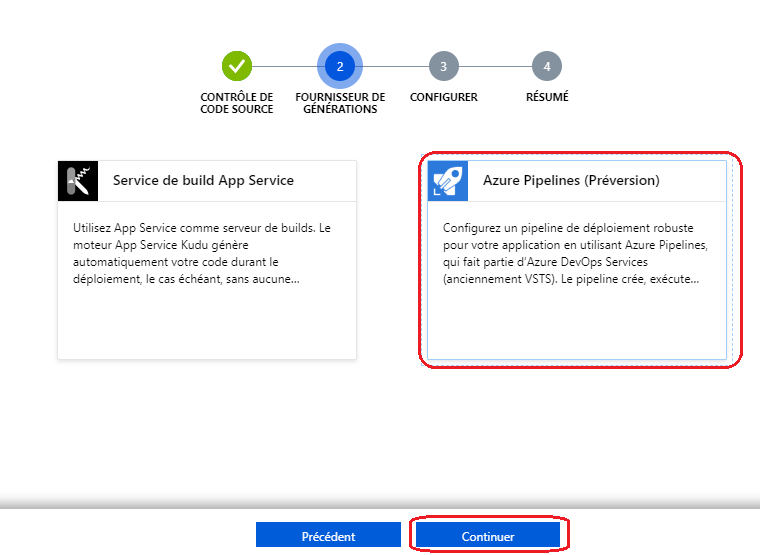

5.  À l'étape **Configurer** :

   * sous la section **Code**, sélectionnez l'**Organisation Azure DevOps**, le **Projet**, le **Référentiel** et la **Branche** que vous souhaitez déployer en continu.
   * sous la section **Build**, sélectionnez **ASP.NET Core**.
   * cliquez sur **Continuer**.

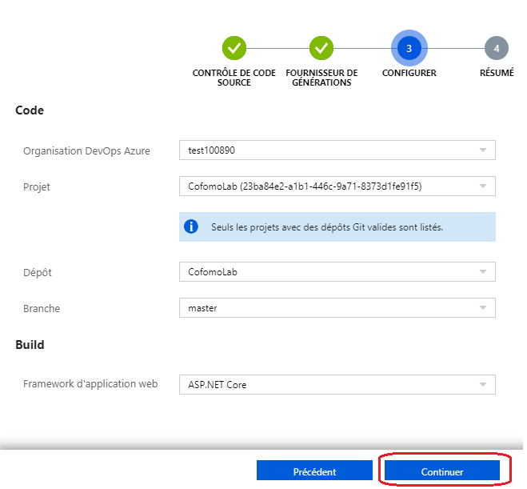

6. Vérifiez que les informations sont correctes à l'étape **Résumé**, puis cliquez sur **Terminer**

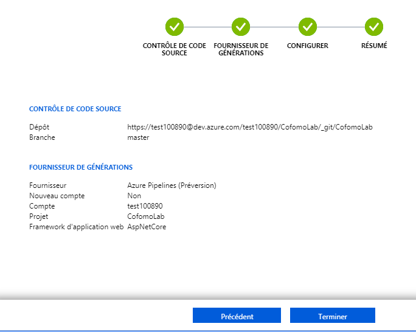
   
Azure App Service va se connecter à votre projet Azure DevOps et proceder à la création du pipeline de CI et CD pour votre application avec Azure Pipelines.

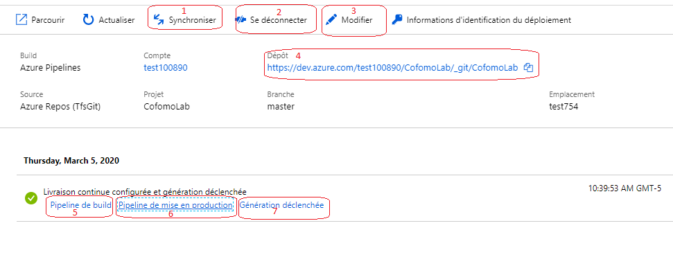

La fenêtre du gestion du Centre de déploiement va vous permettre :

1. Déclencher une nouvelle mise en production avec le bouton **Synchroniser**

2. Désactiver le centrer de déploiement avec le bouton **Se déconnecter**

3. Visualiser et modifier le pipeline d'intégration continue avec le bouton **Modifier**

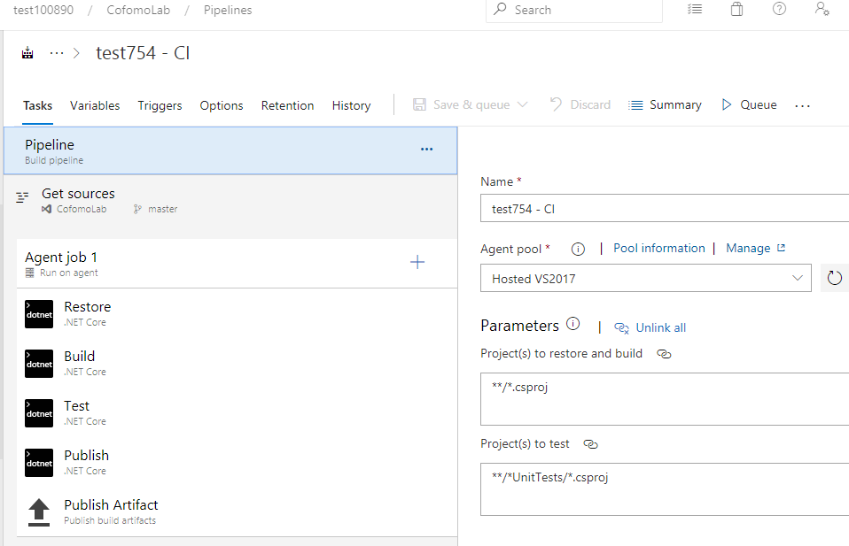

4. Visualiser votre dépôt dans Azure Repos en cliquant sur le lien dans la zone **Dépôt**

5. Visualiser le **Pipeline de build**

6. Visualiser le **Pipeline de mise en production**

7. Visualiser la **Génération déclenchée**

## Modifier un fichier dans Azure Repos

1. Cliquez sur le lien en  **Dépôt** dans le centre de déploiement

2. Dans **Azure Repos*, cliquez sur le dossier **src/Workshop**, puis le dossier **WebApp**, ensuite le dossier **Views**, déroulez le dossier **Home** et sélectionnez le fichier **Index.cshtml**

3. Cliquez sur le bouton **Edit**

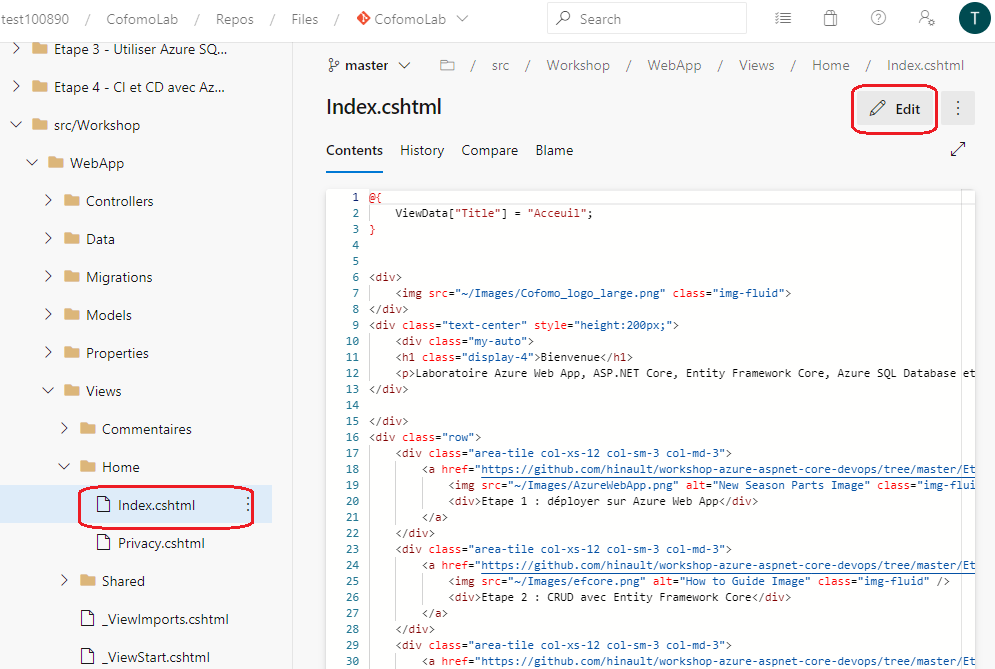

4. A la suite de la ligne de code 

```html
<h1 class="display-4">Bienvenue</h1>
```

Ajoutez 

```html
<p>Déployé avec Azure Pipelines.</p>
```
5. Cliquez sur **Commit**

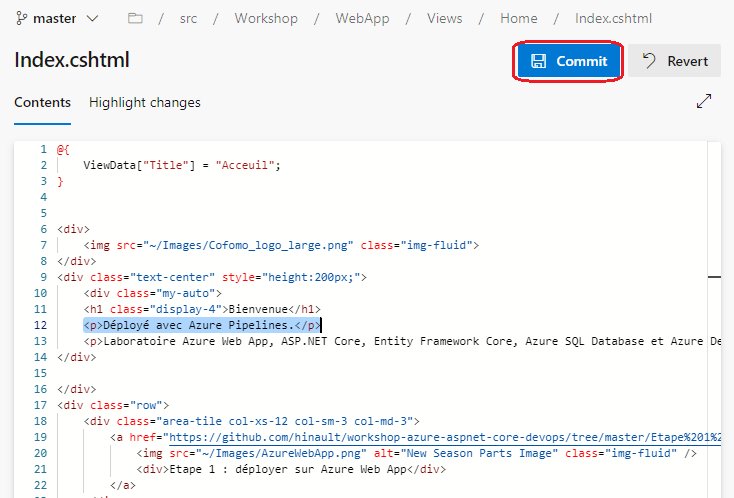

6. Puis suis **Commit** pour enregistrer

Le pipeline de CI et CD sera automatiquement enclenché. Une fois la mise en proudction terminée accedez à votre application pour valider les changements.

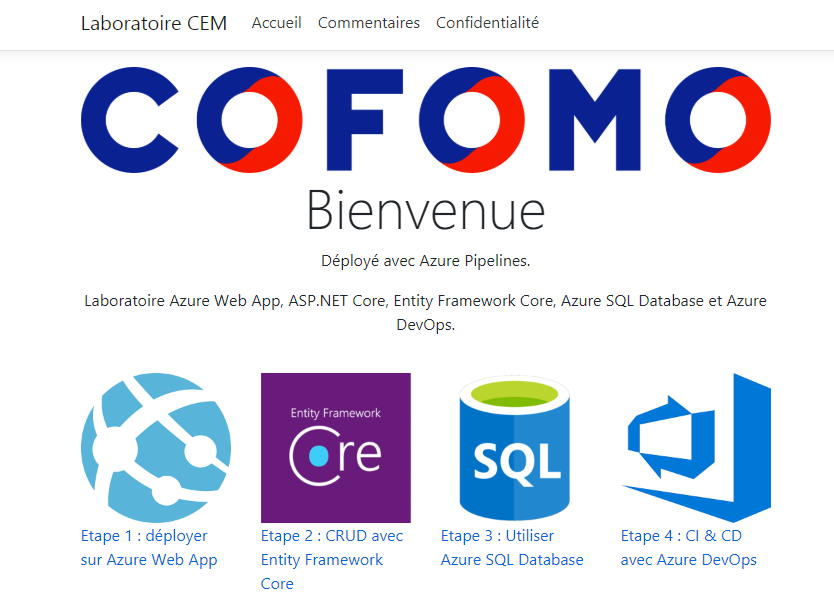

**Félicitations! Vous avez terminé toutes les étapes du laboratoire.**

## FIN
