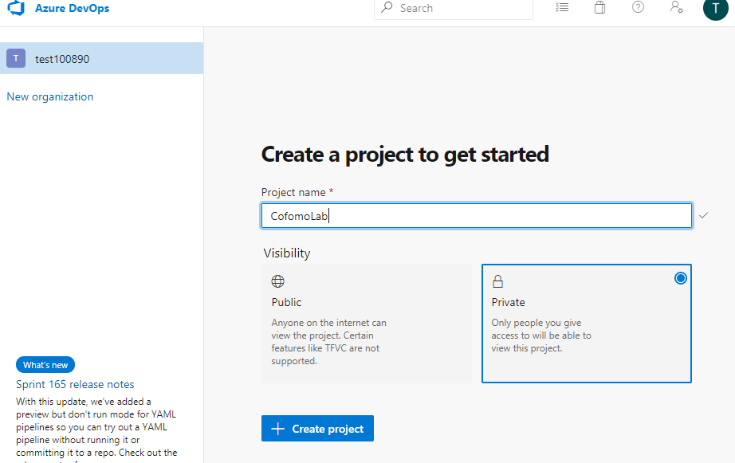
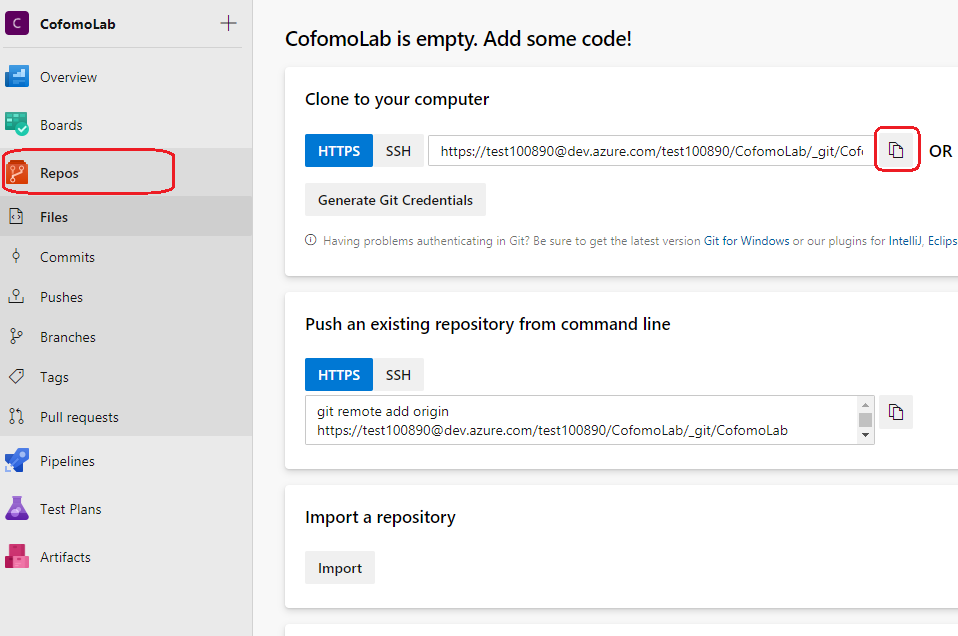

# CI & CD avec Azure DevOps

Azure DevOps offre un ensemble de services de développement modernes pour la planification agile, la collaboration, l'intégration continue et la livraison rapide des applications.

##  Objectif

Dans ce quatrième et dernier laboratoire, nous allons utiliser Azure DevOps pour déployer une application ASP.NET Core sur Azure App Service. Nous allons nous familliariser avec les outils services suivants d'Azure DevOps :

1. **Azure Repos** : gestionnaire de version Git hébergé dans Cloud permettant de collaborer et créer un code de meilleure qualité avec les demandes de tirage et la gestion avancée des fichiers.

2. **Azure Pipelines** : service Cloud permettant de générer, tester et déployer des application avec une approche CI/CD qui fonctionne avec n’importe quel langage, plateforme et cloud. 

## Créer un projet Azure DevOps

Allez sur **<a href="http://dev.azure.com/">dev.azure.com</a>**.  Cliquez sur **Démarrer gratuitement**.
  


Vous devez ensuite vous authentifier avec votre compte Microsoft Azure. Puis cliquer sur **Continuer**.

Une nouvelle organisation Azure sera créée pour votre compte. Vous devez ajouter à cette dernière un nouveau projet. Il suffit juste de renseigner le nom du projet, puis cliquer sur **Create project**.



## Pousser le code dans Azure Repos

Dans Azure DevOps, cliquez dans le menu à gauche sur **Repos**.

Copiez le lien dans la zone **Clone to your computer**



Ouvrez l'invite de commande à partir du repertoire **workshop-azure-aspnet-core-devops**.

> Le moyen le plus simple de le faire avec Visual Studio est d'aller sur **Team Explorer**, puis cliquer sur **Modifications**, ensuite sur **Actions** et enfin sur **Ouvrir l'invite de commandes**.

Executez ensuite la commande :

```
git remote set-url origin [url-depot-azure-repos]
```

Et ensuite la commande 

```
git push -u origin --all 
```

> Une fênetre d'authentification va s'afficher. Veuillez vous authentifier avec votre compte Azure.


Retournez dans Azure DevOps et actualisez la page. Vous devez voir les fichiers du laboratoire dans votre dépôt :


